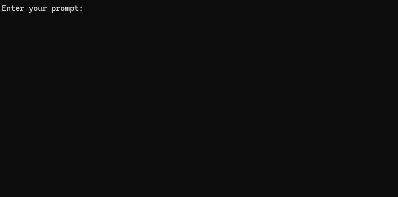

# 🌐 Web-Augmented Generation
This Node.js application performs web-augmented generation using various LLM providers and web search results from SearXNG.

### Maintained by
<a href="https://www.equilllabs.com">
  
</a>

<br>
<br>

## Features

- Rephrases user queries for optimal web searching
- Searches the web using SearXNG
- Fetches and summarizes content from search results
- Generates responses using various LLM providers via OpenAI-compatible API calls
- Supports streaming responses for real-time output
- Logs detailed information about the process
- Implements content similarity checking and repetition detection
- Features an interactive CLI
- Includes comprehensive error handling and logging
- Supports multiple LLM providers (Ollama, together.ai, llama.cpp)


## Prerequisites

- Node.js (version 16 or higher)
- npm (Node Package Manager)
- LLM provider running locally or remotely (or any LLM Inference Service that is compatible with OpenAI API calls)
- Access to a SearXNG instance

## Setup

1. Clone the repository:
   ```
   git clone https://github.com/jparkerweb/web-augmented-generation.git
   cd web-augmented-generation
   ```

2. Install dependencies:
   ```
   npm ci
   ```

3. Copy the `.env.example` file to `.env`:
   ```
   cp .env.example .env
   ```

4. Edit the `.env` file and update the values as needed:

```env
######################
## General Settings ##
######################
NUM_URLS=10                                                           # Number of URLs to fetch
SEARXNG_URL=https://searx.be/                                         # URL of the SearXNG server
SEARXNG_URL_EXTRA_PARAMETER="key=optional_auth_key_here&language=en"  # Extra parameter for SearXNG URL
SEARXNG_FORMAT=html                                                   # Format for SearXNG results (html or json)
FETCH_TIMEOUT_MS=5000                                                 # Timeout for fetching URLs
DISABLE_SSL_VALIDATION=true                                           # Whether to disable SSL validation

##################
## LLM Settings ##
##################
LLM_STREAM_RESPONSE=true                             # Whether to stream the LLM response

# Ollama Local Configuration
LLM_BASE_URL=http://localhost:11434/v1               # Base URL for the LLM API (OpenAI format)
LLM_API_KEY=ollama!!!                                # API key for the LLM (use 'ollama' for Ollama)
LLM_MODEL=llama3.2:1b                                # Model to use with the LLM API

####################################
## Scraped Page Content Settings ##
####################################

# Semantic Chunking Settings
CHUNK_CONTENT=true                                   # Enable semantic chunking for better quality answers
CHUNK_CONTENT_USE_HYBRID_FALLBACK=true               # Enable hybrid mode to fallback to summarization if no chunks found
## The following parameters are only used by the `chunk-match` library (if CHUNK_CONTENT is set to true)
CHUNK_CONTENT_MAX_RESULTS=10
CHUNK_CONTENT_MIN_SIMILARITY=0.375
CHUNK_CONTENT_MAX_TOKEN_SIZE=500
CHUNK_CONTENT_SIMILARITY_THRESHOLD=0.4
CHUNK_CONTENT_DYNAMIC_THRESHOLD_LOWER_BOUND=0.3
CHUNK_CONTENT_DYNAMIC_THRESHOLD_UPPER_BOUND=0.5
CHUNK_CONTENT_NUM_SIMILARITY_SENTENCES_LOOKAHEAD=3
CHUNK_CONTENT_COMBINE_CHUNKS=true
CHUNK_CONTENT_COMBINE_CHUNKS_SIMILARITY_THRESHOLD=0.5
CHUNK_CONTENT_ONNX_EMBEDDING_MODEL="Xenova/all-MiniLM-L6-v2"
CHUNK_CONTENT_DTYPE="q8"

# Raw Content Settings (used when CHUNK_CONTENT=false)
WEB_PAGE_CONTENT_MAX_LENGTH=1000                     # Maximum length of raw page content to send to LLM
```

Alternative LLM Provider Configurations:

```env
# together.ai Configuration
LLM_BASE_URL=https://api.together.xyz/v1
LLM_API_KEY=xxxxxxxxxxxxxxxxxxxxxxxxxxxxxxxxxxxxx
LLM_MODEL=meta-llama/Llama-3.2-3B-Instruct-Turbo

# llama.cpp Configuration
LLM_BASE_URL=http://localhost:8080/v1
LLM_API_KEY=not-needed
LLM_MODEL=not-needed

# OpenRouter Configuration
LLM_BASE_URL=https://openrouter.ai/api/v1
LLM_API_KEY=xxxxxxxxxxxxxxxxxxxxxxxxxxxxxxxxxxxxx
LLM_MODEL=google/gemini-pro-1.5-exp

# Google AI Studio Configuration
LLM_BASE_URL=https://generativelanguage.googleapis.com/v1beta/openai/
LLM_API_KEY=xxxxxxxxxxxxxxxxxxxxxxxxxxxxxxxxxxxxx
LLM_MODEL=gemini-exp-1121
```

The configuration includes:
- General settings for web search and content fetching
- LLM provider settings with support for multiple providers
- Content processing settings with semantic chunking options
- Raw content handling parameters

## LLM Configuration

This application uses the OpenAI API format for language model interactions. You can configure it to work with Ollama or other OpenAI-compatible APIs. Here's how to set it up:

### For Ollama:

1. Make sure Ollama is running at the URL specified in your `.env` file.
2. Set the following variables in your `.env` file:
   ```
   LLM_BASE_URL=http://localhost:11434/v1
   LLM_API_KEY=ollama
   LLM_MODEL=llama3.2:1b
   ```
   Replace `llama3.2:1b` with the name of the model you want to use in Ollama.

### For OpenAI or other compatible APIs:

1. Set the following variables in your `.env` file:
   ```
   LLM_BASE_URL=https://api.openai.com/v1
   LLM_API_KEY=your_api_key_here
   LLM_MODEL=gpt-3.5-turbo
   ```
   Replace `your_api_key_here` with your actual API key, and `gpt-3.5-turbo` with the model you want to use.

The application will use these settings to make API calls to the language model for tasks such as rephrasing queries and generating responses.

## Usage

Run the application with or without a query:

```
node main.js "Your question or prompt here"
```

or use the ask script for a more interactive experience:

```
node ask.js
```

_If you don't provide a query, the application will prompt you to enter one._

The application will:
1. Rephrase the query for better search results
2. Search the web using SearXNG
3. Fetch and summarize content from the search results
4. Check for content similarity to avoid repetitive information
5. Generate a response using the configured LLM, incorporating the web-sourced information
6. Display real-time progress with an interactive countdown timer
7. Log the process details to `log.txt`

The generated response will be displayed in the console and appended to the log file.

## Error Handling

If an error occurs during execution, it will be logged to `error_log.txt` in the project directory.

## Files

- `main.js`: Main application logic
- `.env`: Configuration file (create this from `.env.example`)
- `log.txt`: Detailed log of each run
- `error_log.txt`: Error log (created if errors occur)
- `completion_flag.txt`: Created when the process completes successfully

## Note

This application uses web scraping and AI-generated content. Ensure you comply with the terms of service of the websites you're accessing and the AI models you're using.

## Running SearXNG Locally (Docker)

If you want to run SearXNG locally using Docker, follow these steps:

1. Pull the latest SearXNG Docker image:
   ```
   docker pull searxng/searxng
   ```

2. Create a directory for SearXNG configuration:
   ```
   mkdir searxng-config
   ```

3. Create a settings.yml file in the searxng-config directory:
   ```
   touch searxng-config/settings.yml
   ```

4. Edit the settings.yml file to ensure that 'json' is included in the 'formats' list:
   ```
   nano searxng-config/settings.yml
   ```
   Add or modify the following lines:
   ```yaml
   search:
     formats:
       - html
       - json
   ```

5. Run the SearXNG Docker container:
   ```
   docker run -d \
     -v $(pwd)/searxng-config:/etc/searxng \
     -p 8787:8080 \
     -e BASE_URL=http://localhost:8787/ \
     -e INSTANCE_NAME=my-searxng \
     searxng/searxng
   ```

6. Access your local SearXNG instance at `http://localhost:8787`

7. Update your .env file to use the local SearXNG instance:
   ```
   SEARXNG_URL=http://localhost:8787
   ```

Now you have a local SearXNG instance running on port 8787 with JSON output enabled, which you can use with this application.

## Config Options

- `SEARXNG_URL_EXTRA_PARAMETER`: This field allows you to add extra parameters to the SearXNG search URL. It can be used for various purposes:
  - Authentication: If your SearXNG instance requires an API key or token, you can add it here. For example: `key=your_auth_key_here`
  - Custom search parameters: You can add any SearXNG-specific parameters to customize your search. For example: `language=en&time_range=year`
  - Multiple parameters: You can combine multiple parameters using `&`. For example: `key=your_auth_key_here&language=en`

- `SEARXNG_FORMAT`: This field determines the format of the SearXNG search results. It can be set to either 'html' or 'json':
  - 'html': The application will parse HTML responses from SearXNG
  - 'json': The application will expect and parse JSON responses from SearXNG (default)

  Example usage in .env file:
  ```
  SEARXNG_URL_EXTRA_PARAMETER="key=abcdef123456&language=en"
  SEARXNG_FORMAT=json
  ```

  This would append `&key=abcdef123456&language=en` to the SearXNG search URL, and the application will expect and parse JSON responses from SearXNG.

- `DISABLE_SSL_VALIDATION`: Set to 'true' to disable SSL certificate validation (default: false, use with caution)

- `LLM_STREAM_RESPONSE`: This field determines whether the LLM responses should be streamed in real-time or returned as a single response:
  - 'true': The application will stream the LLM responses, providing real-time output
  - 'false': The application will return the LLM response as a single block of text

  Example usage in .env file:
  ```
  LLM_STREAM_RESPONSE=true
  ```

  This would enable streaming of LLM responses, providing a more interactive experience.

---

## Example Nginx Configuration with Authentication Key
 _(example serving SearXNG on port 8787)_

```nginx
    server {
        listen       80;
        listen       443 ssl;
        server_name  searxng.acme.org;
        ssl_certificate         C:/some-path/fullchain.pem;
        ssl_certificate_key     C:/some-path/privkey.pem;

        # Define a variable to store the API key
        set $api_key "eXamPle__Key!!!";

        # Use a secure cookie to store the key
        set $key_cookie "searxng_key";

        # Add resolver directive
        resolver 127.0.0.1;

        # Debug logging
        error_log  logs/error.log debug;

        # Check if the key is valid
        set $key_valid 0;
        if ($arg_key = $api_key) {
            set $key_valid 1;
        }
        if ($cookie_searxng_key = $api_key) {
            set $key_valid 1;
        }

        # Allow access to static files without key
        location /static/ {
            proxy_pass http://127.0.0.1:8787;
            proxy_buffering off;
        }

        # Redirect all requests without a valid key to a default error page or login page
        location = / {
            if ($key_valid = 0) {
                return 403;
            }
            proxy_pass http://127.0.0.1:8787;
            proxy_buffering off;
        }

        location / {
            # Debug headers (always add these for debugging)
            add_header X-Debug-Key-Valid $key_valid always;
            add_header X-Debug-Arg-Key $arg_key always;
            add_header X-Debug-Cookie-Key $cookie_searxng_key always;

            # If the key is not valid, return 403
            if ($key_valid = 0) {
                return 403;
            }

            # Set the cookie if the key is provided in the URL
            if ($arg_key = $api_key) {
                add_header Set-Cookie "${key_cookie}=$arg_key; HttpOnly; Secure; SameSite=Strict; Path=/;" always;
            }

            # Proxy headers
            proxy_set_header Host $host;
            proxy_set_header X-Real-IP $remote_addr;
            proxy_set_header X-Forwarded-For $proxy_add_x_forwarded_for;
            proxy_set_header X-Forwarded-Proto $scheme;

            # Preserve the key parameter during redirects
            proxy_redirect ~^(https?://[^/]+)(.*)$ $1$2$is_args$args;

            # Pass the request to the upstream server
            proxy_pass http://127.0.0.1:8787;
            proxy_buffering off;
        }
    }
```

## Ask Scripts

This project includes convenient scripts to run the application from the command line. These scripts are located in the `ask-scripts` directory:

- `ask`: Universal script for Unix-like systems and Windows
- `ask.sh`: Bash script for Unix-like systems
- `ask.bat`: Batch script for Windows Command Prompt
- `ask.ps1`: PowerShell script for Windows PowerShell

### Usage

To use these scripts globally, you need to add the `ask-scripts` directory to your system's PATH. Here are instructions for different operating systems:

#### Windows

1. Open the Start menu and search for "Environment Variables"
2. Click on "Edit the system environment variables"
3. Click the "Environment Variables" button
4. Under "System variables", find and select the "Path" variable, then click "Edit"
5. Click "New" and add the full path to your `ask-scripts` directory
6. Click "OK" to close all dialogs

#### macOS and Linux

1. Open your shell configuration file (e.g., `~/.bashrc`, `~/.zshrc`, or `~/.bash_profile`)
2. Add the following line, replacing `/path/to/ask-scripts` with the actual path:
   ```
   export PATH="$PATH:/path/to/ask-scripts"
   ```
3. Save the file and restart your terminal or run `source ~/.bashrc` (or the appropriate file you edited)

### Running the Scripts

Once the `ask-scripts` directory is in your PATH, you can run the application from anywhere by simply typing:

```
ask
```

The script will then prompt you to enter your question or prompt.

This command will automatically use the appropriate script for your system:

- On Unix-like systems (Linux, macOS), it will use the bash script.
- On Windows, it will detect your environment and use the appropriate script (PowerShell or Command Prompt).

You don't need to provide the question or prompt as a command-line argument. The script will interactively ask for your input.

These scripts provide a convenient way to interact with the application without having to navigate to the project directory or manually run `node main.js` each time.



---

## Hosting Ollama via NGINX Reverse Proxy

If you want to host Ollama behind an NGINX reverse proxy, you can use the following configuration as a starting point. This setup includes SSL and basic API key authentication.

```nginx
# -------------------------
# -- ollama.yourdomain.com --
# -------------------------
upstream ollama {
    server               127.0.0.1:11434;
}
server {
    listen 80;
    listen 443 ssl;
    server_name ollama.yourdomain.com;
    ssl_certificate         C:/Certbot/live/ollama.yourdomain.com/fullchain.pem;
    ssl_certificate_key     C:/Certbot/live/ollama.yourdomain.com/privkey.pem;

    location / {
        # Check if the Authorization header is present and has the correct Bearer token / API Key
        set $token "Bearer MY_PRIVATE_API_KEY";
        if ($http_authorization != $token) {
            return 401 "Unauthorized";
        }

        # The localhost headers are to simulate the forwarded request as coming from localhost
        # so we dont have to set the Ollama origins as *
        proxy_set_header  Host "127.0.0.1";
        proxy_set_header  X-Real-IP "127.0.0.1";
        proxy_set_header  X-Forwarded-For "127.0.0.1";
        proxy_set_header  X-Forwarded-Proto $scheme;
        proxy_pass        http://ollama;  # Forward request to the actual web service
    }
}
```

This configuration does the following:

1. Sets up an upstream server for Ollama running on localhost port 11434.
2. Configures the server to listen on both HTTP (80) and HTTPS (443) ports.
3. Specifies the SSL certificate and key locations.
4. Implements a basic API key check using the Authorization header.
5. Forwards requests to the Ollama service, simulating them as coming from localhost.

Remember to replace `MY_PRIVATE_API_KEY` with your actual API key, and ensure that the SSL certificate paths are correct for your system.

When using this configuration, update your `.env` file to point to your NGINX-proxied Ollama instance:

```
LLM_BASE_URL=https://ollama.yourdomain.com/v1
LLM_API_KEY=MY_PRIVATE_API_KEY
LLM_MODEL=llama3.2:1b
```

This setup allows you to securely expose your Ollama instance to the internet while maintaining control over access through API key authentication.

---

## Appreciation
If you enjoy this project please consider sending me a tip to support my work 😀
# [🍵 tip me here](https://ko-fi.com/jparkerweb)
